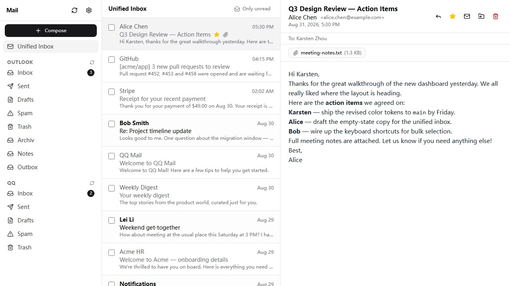

# ACFB Email Client

A Cloudflare based (ACFB) web email client that runs on Cloudflare Workers (Free tier). Connect multiple email accounts and read, send, and organize mail through one unified interface.

## Features

- **Free & open source** — MIT licensed, no ads, no tracking, no telemetry; runs on Cloudflare's free tier.
- **Privacy-first** — your data stays in your Cloudflare account, protected by Cloudflare Access. No third parties involved.
- **A full email client** — connect almost any provider and read, send, and organize mail in one place.
- **Modern UX** — responsive, multilingual (i18n), and dark/light themes.

## Quick start

If you want to have your own email client, see [docs/deployment.md](./docs/deployment.md).

If you want to develop or contribute, see [docs/contributing.md](./docs/contributing.md).

## Documentation

The full docs (VitePress) live under [`docs/`](./docs/): [architecture](./docs/architecture.md), [security](./docs/security.md), [contributing](./docs/contributing.md), and [deployment](./docs/deployment.md).

## Limitations

- **SMTP port 25 is blocked by Cloudflare Workers**; use submission ports 587/465.
- Outbound email is sent from Cloudflare's IP, so SPF/DMARC records for your domain must include Cloudflare's sending IPs (or DNS-based SPF for the outbound range).

## TODO

- [ ] Trace upstream issues
  - [ ] [🐛 Bug Report — Runtime APIs: `node:stream` on workerd drops a `'readable'` event under a reentrancy-guarded reader with manual backpressure](https://github.com/cloudflare/workerd/issues/7136)
  - [ ] [Type error when registering plugin with ESLint `defineConfig`](https://github.com/intlify/eslint-plugin-vue-i18n/issues/767)
  - [ ] [Wrangler D1 Migrations Path Bug (Vite Plugin)](https://github.com/cloudflare/workers-sdk/issues/15484)
